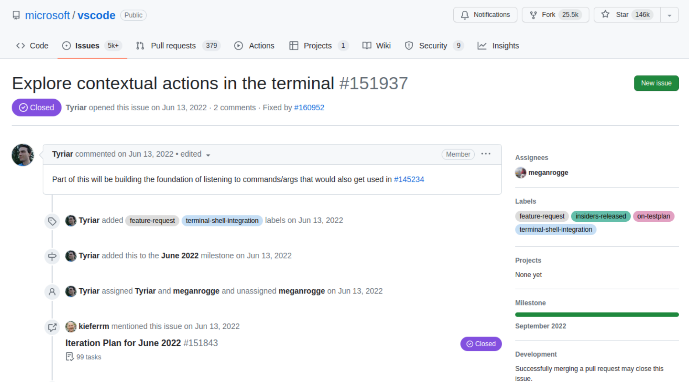

*(이전 글: [나의 얼렁뚱땅 오픈소스 참여기 - part 2](../my-first-open-source-part2/))*

<br>
<br>

“어, 이거 왜 안 돼? 내 코드 어디 갔어!”

여느 때와 마찬가지로 VS Code를 열고 뭔가 작업을 하던 중이었다. 누를 때마다 뿌듯해하던 나의 터미널 단축키, `cmd+.`이 동작을 안 하고 있었다. 뭔가 안 좋은 느낌이 스치고 지나갔다. 무슨 일인가가 생긴 것이다. 순간, 얼마 전에 VS Code가 업데이트되었던 것이 떠올랐다. 그래, 뭔가 바뀌었어.

_*_

그러고 나서도 한참 시간이 흘렀다. 약간의 짬이 생긴 주말 저녁이었다. 성질 나는데 그 문제나 한번 알아볼까? 물론 진짜 성질이 난 건 아니었다. 다만, 나의 유일무이한(!) 오픈소스 업적이 훼손된 것에 대한 찜찜함이 마음 한켠에 남아있던 참이었다.

일단, 어느 시점에 내 코드가 사라진 것인지 조사했다. 사라진 코드를 찾는 커맨드는 `git log -G` 라고 검색이 되었다. VS Code의 최신 코드를 pull 받은 후, 그걸로 내 코드의 주석 부분을 검색했다. 코드 자체는 이후의 리팩토링 등으로 변경되었을 수도 있으므로 주석을 찾는 게 더 나을 거라는 생각이 들었다. 내 코드의 주석은 `// Break: ctrl+C` 이었으므로

```bash
$ git log -G"//\sBreak:\sctrl\+C" --oneline
```

으로 찾아보았다. 나왔다.

```bash
de450f991c2 add basic contextual commands (#160952)
58af29738a1 Add terminal keybinding for cmd+. → ctrl+c to match macOS Terminal
(END)
```

`58af29738a1`가 내가 작성한 커밋이었으니, 그 위에 표시된 `de450f991c2`가 문제의 커밋, 내 코드를 무자비하게 없애버린 커밋일 터였다. GitHub의 VS Code 저장소에서 검색을 하니 그 커밋에 대한 아래 페이지로 연결이 되었다.

<figure>
  
  <figcaption class="left">내 코드를 지워버린 문제의 커밋</figcaption>
</figure>


그리고 이 커밋을 포함한 PR은 #160952 라고 나와 있었고,


<figure>
  
  <figcaption class="left">내 코드를 지워버린 문제의 커밋의 PR</figcaption>
</figure>


이건 다시 이슈 번호 #151937 에 대한 것이라고 했다.


<figure>
  
  <figcaption class="left">내 코드를 지워버린 문제의 커밋의 PR에 대한 issue</figcaption>
</figure>


뭔가 복잡하게 돌아가는 것을 보니... 누군가가 그냥 심심해서 내 코드를 지운 건 아닌 것 같았다.

_*_

좀 더 추적 조사한 결과, 결국 원인이 밝혀졌다. 'Terminal Quick Fixes' 라고 이름붙은 기능이 들어가기 위해서 내 코드가 희생된 것이었다. T_T


<figure>
  
  <figcaption class="left">VS Code 1.72 버전의 release note</figcaption>
</figure>


<figure>
  
  <figcaption class="left">Terminal Quick Fixes 기능을 소개하는 트윗</figcaption>
</figure>


그래, 그랬구나. 그런 것이었어...

코드란 원래 그런 것이다. 필요에 의해 만들어지고, 얼마간 제 역할을 한 다음, 때가 되면 사라지는 것. 문제는, 그게 나의 유일한 오픈소스 업적이었고, 제 역할을 한 시간이 너무나 짧았다는 것. 흙흙흙. 이렇게 해서 에어컨의 발명자 캐리어 님과 어깨를 나란히 해보려던 나의 가여운 소망은 가벼이 날아가버리고 말았다. (길이도) 짧았던 내 코드는 (수명도) 짧게 사라졌다.

조금 아쉽지만, 뭐 그래도, 어쨌든 이렇게 이야기거리 하나는 남았다. 그러면 되었다.

<br>
<br>

### Links

- [git-log - Show commit logs](https://git-scm.com/docs/git-log#Documentation/git-log.txt--Gltregexgt)
- [VS Code - commit de450f991c2](https://github.com/microsoft/vscode/commit/de450f991c2daa1f3207dfff4a4d7a3ffb2fd699)
- [VS Code - PR #160952](https://github.com/microsoft/vscode/pull/160952)
- [VS Code - issue #151937](https://github.com/microsoft/vscode/issues/151937)
- [VS Code release note - version 1.72](https://code.visualstudio.com/updates/v1_72#_terminal-quick-fixes)
- [Tweet on Terminal Quick Fixes](https://twitter.com/code/status/1578085905188913161?lang=en)
